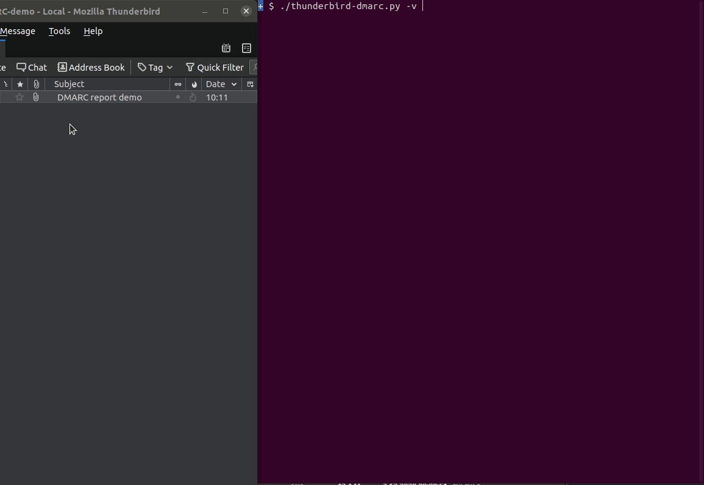

# Thunderbird-DMARC
Read your DMARC aggregate reports just by drag-and-dropping from Thunderbird.

This is only suitable for small domains that don't receive many reports.
I wrote it just because I was too lazy to deploy a real DMARC monitoring
system.

Drag-and-drop from Thunderbird to a terminal produces something like this:
`mailbox:///home/user/.thunderbird/something.default-release/Mail/name/Inbox.sbd/DMARC?number=21`.


(The colors in this GIF are not really accurate, the `pass` and `none`
keywords are green in real life.)

This program takes this `mailbox://` URI as an argument, reads the e-mail
message, unzips the `.zip` attachment, and writes the XML file's contents to
stdout. Multiple URIs can be specified, this is especially useful with
`--save`.

Note: A recent Thunderbird update seems to have changed the behavior when
drag-and-dropping multiple messages. It now produces a different URI that
cannot be used with this script and as a result, e-mails have to be
drag-and-dropped one by one.


## Usage
```console
$ ./thunderbird-dmarc.py -h
usage: thunderbird-dmarc.py [-h] [--verbose] [--debug]
                            [--color {never,always,auto}] [--save]
                            URI [URI ...]

Read DMARC aggregate reports drag-and-dropped from Thunderbird.

positional arguments:
  URI                   drag-and-dropped e-mail message URI

optional arguments:
  -h, --help            show this help message and exit
  --verbose, -v         log INFO level messages
  --debug, -D           log DEBUG level messages. Overrides --verbose.
  --color {never,always,auto}
                        colorize output. Default: auto
  --save                save the xml file(s) in the current working directory.
                        Fail if file exists.
```

You may want to use `bash` for this because `zsh` does not like the question
mark in the URI. Or use the simple [`zsh-wrapper`](./zsh-wrapper).


## Installation
```
# clone this git repository and cd into it
pip3 install .
```


## Troubleshooting
### Program reads incorrect e-mail message
(Off-by-one errors and such.)

This can happen if a message is removed from the mailbox folder, but the
`.msf` index hasn't been rebuilt yet. This can be easily fixed from
Thunderbird's GUI (Repair Folder).

I recommend having a separate folder just for DMARC reports, so that this does
not happen.
